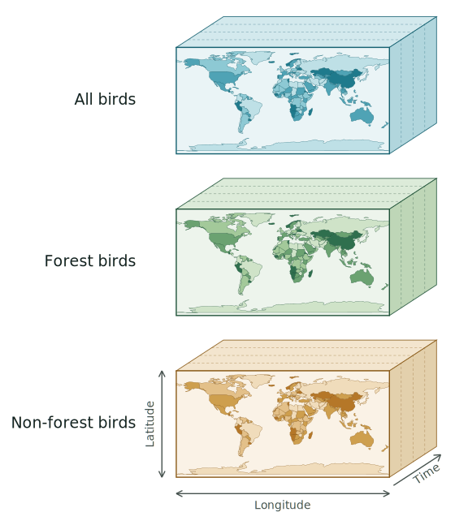

# Overview {.unnumbered}
::: {.grid .mt-3 .mb-4}

::: {.g-col-9 .g-col-md-11}
[A step-by-step tutorial on turning your data into an EBVCube with the `ebvcube` R package, then validating, visualizing and publishing it as a citable, FAIR dataset on the EBV Data Portal.]{.lead}
:::
:::

::: {.callout-note appearance="simple"}
**New to this?** \
Eight units, each runnable against a real published dataset. Begin
with [Unit 1 — Introduction](01-introduction.qmd), or jump straight to any unit below.

[R ≥ 4.2 · 4 MB example download · no prior netCDF experience needed]{.small .text-muted}
:::


## Four dimensions, one file

::: {.grid}

::: {.g-col-12 .g-col-md-5}
{fig-alt="An EBVCube shown as three stacked boxes, one per entity: All birds, Forest birds and Non-forest birds. The front face of each box is a world map, with longitude running horizontally and latitude vertically; time runs back along the depth axis."}
:::

::: {.g-col-12 .g-col-md-7}
An EBVCube is the standard format for publishing **Essential Biodiversity Variables**, the standardised measurements the biodiversity community tracks in common. It is a netCDF file organised in a defined way and following the CF and ACDD metadata conventions, so every dataset, whatever produced it, is structured the same way. That is what makes two of them comparable. [Unit 1](01-introduction.qmd) covers the framework.

The figure shows the tutorial's own example, dataset `id = 1`: three entities, each a
box whose front face is the world grid, with time running back along the depth axis.

::: {.grid}

::: {.g-col-6 .border .rounded .p-3}
`lon`

[The x axis of the grid. You fix it once, with `extent` and `resolution`.]{.small .text-muted}
:::

::: {.g-col-6 .border .rounded .p-3}
`lat`

[The y axis. Every layer in the file has to share this exact grid and CRS.]{.small .text-muted}
:::

::: {.g-col-6 .border .rounded .p-3}
`time`

[A single date, or a whole series. The dates you declare must match the layers you add.]{.small .text-muted}
:::

::: {.g-col-6 .border .rounded .p-3}
`entity`

[The biological unit: a species, a community, an ecosystem.]{.small .text-muted}

:::

:::

:::

:::

::: {.callout-note appearance="simple"}
**Metric** and **scenario** are not dimensions, they organise the cubes *inside*
the file. The file as a whole is the EBVCube; inside it, each **metric** holds one
four-dimensional array named `ebv_cube`, carrying the `lon`, `lat`, `time` and
`entity` dimensions above. A **scenario**, when a dataset has one, adds a level on
top: `scenario_1/metric_1/ebv_cube`.

Dataset `id = 1` has two metrics and no scenarios, so it holds exactly two arrays:
`metric_1/ebv_cube` and `metric_2/ebv_cube`.
:::


## Half in R, half on the portal

You build and check the file locally, then hand it over. Knowing which half you are in
tells you which unit to open.

```{mermaid}
%%| echo: false
flowchart LR
  subgraph inR["In R — units 2 to 5"]
    direction LR
    A["Prepare<br/>data"] --> B["ebv_metadata()<br/>write the JSON"]
    B --> C["ebv_create()<br/>empty netCDF"]
    C --> D["ebv_add_data()<br/>fill the cubes"]
    D --> E["Validate and visualise<br/>check before sharing"]
  end
  subgraph onP["On the portal — unit 6"]
    direction LR
    F["Upload<br/>submit for review"] --> G["Review<br/>by the portal team"]
    G --> H["Publish<br/>receive a DOI"]
  end
  E --> F
  classDef rstep fill:#E8F1EA,stroke:#2F6F4E,color:#12211F
  classDef pstep fill:#FBF0DF,stroke:#B57728,color:#12211F
  class A,B,C,D,E rstep
  class F,G,H pstep
  style inR fill:#FFFFFF,stroke:#2F6F4E,color:#2F6F4E
  style onP fill:#FFFFFF,stroke:#B57728,color:#B57728
```

## One real dataset, start to finish

The tutorial is built around one published dataset, id = 1, that you can open on the live portal. The metadata fields and code chunks work against that file, so what you read here is what you'd get running it yourself.

::: {.callout-note}
## Local bird diversity (cSAR/BES-SIM)

[id = 1]{.badge .bg-secondary}
[Community composition]{.badge .bg-secondary}
[3 entities]{.badge .bg-secondary}
[2 metrics]{.badge .bg-secondary}
[1900–2015]{.badge .bg-secondary}

Relative and absolute change in the number of bird species at decadal steps, for
forest, non-forest and all bird species. Roughly 4 MB, downloaded once and cached
locally.

*Martins, I., Pereira, H., Navarro, L. (2022).*
[Dataset page](https://portal.geobon.org/ebv-detail?id=1) ·
DOI [10.25829/8grx36](https://doi.org/10.25829/8grx36)

```{r}
#| eval: false
library(ebvcube)

ebv_download(id = 1, outputdir = "data/ebv", overwrite = FALSE)
```

Every later code chunk starts from that file path. To run the workflow against your
*own* data, point it at your own `.nc` and the rest of the tutorial runs unchanged.
:::

## How this tutorial is organised

Each unit opens with its objectives, works through the step with runnable code and
screenshots, and closes with a checkpoint so you know you are ready to move on.

::: {.grid}

::: {.g-col-12 .g-col-sm-6 .g-col-md-3 .border .rounded .p-3}
[UNIT 1]{.small .text-success}\
**[Introduction](01-introduction.qmd)**

[What EBVs are, and what the portal is for.]{.small .text-muted}
:::

::: {.g-col-12 .g-col-sm-6 .g-col-md-3 .border .rounded .p-3}
[UNIT 2]{.small .text-success}\
**[Installation](02-installation.qmd)**

[Get R, `ebvcube` and its Bioconductor dependencies running.]{.small .text-muted}
:::

::: {.g-col-12 .g-col-sm-6 .g-col-md-3 .border .rounded .p-3}
[UNIT 3]{.small .text-success}\
**[Preparing data](03-preparing.qmd)**

[Line up your rasters, entity list and metadata JSON.]{.small .text-muted}
:::

::: {.g-col-12 .g-col-sm-6 .g-col-md-3 .border .rounded .p-3}
[UNIT 4]{.small .text-success}\
**[Creating the EBVCube](04-creating.qmd)**

[Build the netCDF, fill it, and confirm it is right.]{.small .text-muted}
:::

::: {.g-col-12 .g-col-sm-6 .g-col-md-3 .border .rounded .p-3}
[UNIT 5]{.small .text-success}\
**[Validating and Visualizing](05-validating.qmd)**

[Check the file before anyone else sees it.]{.small .text-muted}
:::

::: {.g-col-12 .g-col-sm-6 .g-col-md-3 .border .rounded .p-3}
[UNIT 6]{.small .text-warning}\
**[Uploading](06-uploading.qmd)**

[Submit through the portal and receive a DOI.]{.small .text-muted}
:::

::: {.g-col-12 .g-col-sm-6 .g-col-md-3 .border .rounded .p-3}
[UNIT 7]{.small .text-warning}\
**[Troubleshooting](07-troubleshooting.qmd)**

[What to do when a step refuses to work.]{.small .text-muted}
:::

::: {.g-col-12 .g-col-sm-6 .g-col-md-3 .border .rounded .p-3}
[UNIT 8]{.small .text-warning}\
**[Further reading](08-references.qmd)**

[Specifications, papers, and where to ask.]{.small .text-muted}
:::

:::

## Before you start

::: {.grid}

::: {.g-col-12 .g-col-md-6}
You do not need prior netCDF experience, [Unit 1](01-introduction.qmd) covers the concepts. It helps to be
comfortable with:

-   basic R: installing packages and running scripts;
-   basic geospatial data in R, at the level of `terra` or `raster`;
-   your own biodiversity rasters, or following along with the example dataset.

The portal units also need a free [GEO BON account](https://members.geobon.org/register/index).
:::

::: {.g-col-12 .g-col-md-6}
**Key resources**

-   [EBV Data Portal](https://portal.geobon.org/) — discover, download and publish EBV datasets.
-   [`ebvcube` on GitHub](https://github.com/EBVcube/ebvcube) — also on [CRAN](https://cran.r-project.org/package=ebvcube) and the [b-cubed r-universe](https://b-cubed-eu.r-universe.dev/ebvcube).
-   [Package documentation](https://EBVcube.github.io/ebvcube/) — the full function reference this tutorial builds on.
-   [Format specification](https://github.com/EBVcube/EBVCube-format) — the structural rules behind the format.
-   [GEO BON — what are EBVs?](https://geobon.org/ebvs/what-are-ebvs/) — the canonical definition and the six classes.
-   [Quoss et al. (2022)](https://biss.pensoft.net/article/91215/) — the methods paper describing the package.
:::

:::

::: {.callout-tip appearance="simple"}
**Working alongside this tutorial.** Every code chunk runs as-is against the example
dataset. If you are preparing your *own* dataset, follow the same steps and swap in
your rasters and metadata where Units 3 and 4 point it out.
:::

